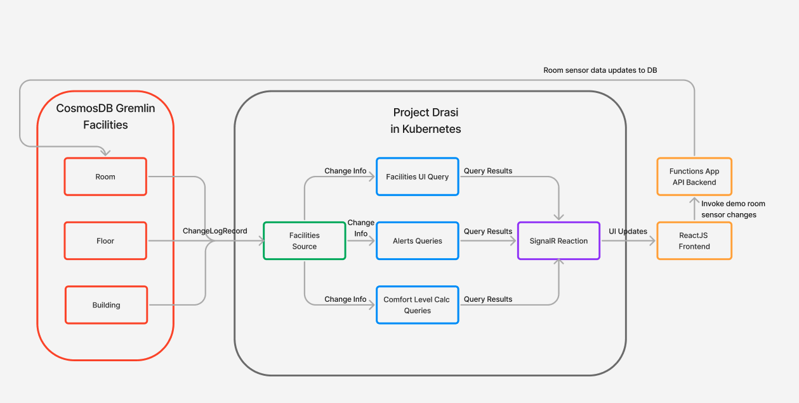
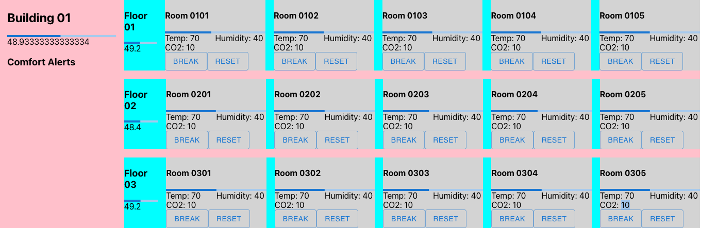
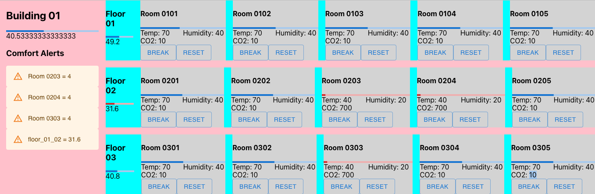

## Prerequisites

- A dev environment with [Node.js 18](https://nodejs.org/).
- [Python 3.8](https://www.python.org/downloads/) or higher.
- An Azure Subscription with permissions to create resources.
- [Azure CLI 2.40](https://docs.microsoft.com/en-us/cli/azure/install-azure-cli) or higher.
- [Azure Functions Core Tools 4.0](https://learn.microsoft.com/en-us/azure/azure-functions/functions-run-local?tabs=v4%2Cmacos%2Ccsharp%2Cportal%2Cbash#install-the-azure-functions-core-tools) or higher.
- A Kubernetes cluster with [Project Drasi deployed]().
- A clone of the [Project Drasi Git repository](https://dev.azure.com/azure-octo/Incubations/_git/ReactiveGraph?path=%2F&version=GBdevelop&_a=contents) on your local machine.

## Overview of the app

This application illustrates the use of Project Drasi for a hypothetical building management scenario, including:

- The use of Continuous Queries over a Cosmos Gremlin database.
- Continuous Queries that include aggregations across hierarchical graph data.
- The use of the Gremlin Reaction to update a Gremlin database based on the output of a Continuous Query.
- The use of the SignalR Reaction to integrate Continuous Query output with a React JS Application.

In this sample, Continuous Queries are used to calculate a _comfort level_ metric for building management. This is a human-centric measurement that combines the physical measurements in a room such as temperature, humidity, and CO2 levels into a perceptual rating of its comfort. For the purposes of this sample, the comfort level will be calculated dynamically for a room from the physical measurements using the simplified formula:

```text
comfortLevel = trunc(50+(temp-72) + (humidity-42) + if( CO2 > 500,(CO2 - 500)/25,0)) 
```

A range of 40 to 50 is considered acceptable: a value below 40 indicates that temperature and/or humidity is too low, while a value above 50 indicates that temperature, humidity, and/or CO2 levels are too high.

The app will provide a dashboard frontend to visualize the comfort levels of rooms and floors, as well as a way to change the environment measurements in the database to simulate changes in the building environment. The dashboard will also show alerts for rooms, floors, and the building when the comfort level is out of range, where the aggregated comfort levels for the floors and building are calculated from the average comfort levels of the rooms and floors respectively by Reactions.

### App Architecture



This app consists of:

- A Source getting changes to building environment data from Cosmos DB.
- Several Continuous Queries that calculate comfort levels and alerts for the rooms, as well as aggregate values for the floors and building as a whole.
- A Gremlin Reaction that updates the Cosmos DB database with the calculated comfort levels and aggregate values based on changes in the room environment measurements.
- A SignalR Reaction that receives changes and forwards them to any connected front end clients.
- An Azure Function App that provides HTTP endpoints for the demo app to directly change the environment values in the database.
- A React frontend that invokes updates via the Function App and listens for changes via the SignalR reaction.

## Deploying the App

### 1. Set up the sample data provider

From the `apps/building-comfort/devops/azure-resources` folder, use the Azure CLI to deploy `cosmosdb.bicep`:

```bash
az login  # If you are not already logged in
az deployment group create -f cosmosdb.bicep --resource-group <your resource group> -p cosmosAccountName=<your account name>
```

Fill in the name of the resource group you want deploy the demo (you will need to [create a new resource group](https://learn.microsoft.com/en-us/azure/azure-resource-manager/management/manage-resource-groups-portal#create-resource-groups) first if you don't already have one), and a name of your choice for the Cosmos DB account. For example:

```bash
az deployment group create -f cosmosdb.bicep --resource-group my-resource-group -p cosmosAccountName=my-drasi-db
```

The bicep deployment will create a new CosmosDb account with the Gremlin API enabled and a database named `Contoso` with an empty `Facilities` graph.

#### Enable Full Fidelity Change Feed (FFCF) on the Cosmos DB account

The FFCF feature for Cosmos DB needs to be enabled for it to work with Project Drasi. You can submit a request for this through the [private preview enrollment form](https://forms.office.com/pages/responsepage.aspx?id=v4j5cvGGr0GRqy180BHbR9ecQmQM5J5LlXYOPoIbyzdUOFVRNUlLUlpRV0dXMjFRNVFXMDNRRjVDNy4u) for your newly created Cosmos DB account.

#### Populate the sample data

Copy the following into a `config.py` file under `apps/building-comfort/devops/data` and edit the `cosmosUri` and `cosmosPassword` values to match your created Cosmos DB account.

```python
cosmosUri = "wss://my-drasi-db.gremlin.cosmos.azure.com:443/"
cosmosUserName = "/dbs/Contoso/colls/Facilities"
cosmosPassword = "xxx...xxx"
buildingCount = 1
floorCount = 3
roomCount = 5
defaultRoomTemp = 70
defaultRoomHumidity = 40
defaultRoomCo2 = 10
```

You can find the values for the `cosmosUri` and `cosmosPassword` in the Azure portal under your Cosmos DB account or by using the Azure CLI:

```bash
# For the cosmosUri, you can use the gremlinEndpoint returned by:
COSMOS_DB_ID=$(az cosmosdb show -n my-drasi-db -g my-resource-group --query id -o tsv)
az resource show --id "$COSMOS_DB_ID" --query properties.gremlinEndpoint -o tsv

# For the cosmosPassword, you can use the primaryMasterKey returned by:
az cosmosdb keys list --name my-drasi-db --resource-group my-resource-group --type keys --query primaryMasterKey -o tsv
```

Once you have the `config.py` file, you can run the `load_graph.py` script in the same directory to populate the graph with sample data:

```bash
pip install gremlinpython  # If you don't already have the gremlinpython package installed
python load_graph.py
```

### 2. Deploy the Drasi components

#### Deploy the sources

From the `apps/building-comfort/devops/reactive-graph` folder, edit the `source-facilities.yaml` file to specify your Cosmos DB instance:

- `SourceAccountEndpoint` with the primary connection string

You can also look up the `SourceAccountEndpoint` value in the Azure portal or by using the Azure CLI:

```bash
az cosmosdb keys list --name my-drasi-db -g my-resource-group --type connection-strings --query "connectionStrings[?contains(description, 'Primary Gremlin Connection String')].[connectionString]" -o tsv
```

Apply the updated yaml file with `kubectl` to your Kubernetes cluster running Drasi:

```bash
kubectl apply -f source-facilities.yaml
```

#### Deploy the queries

From the `apps/building-comfort/devops/reactive-graph` folder, use `kubectl` to deploy the continuous queries:

```bash
kubectl apply -f query-alert.yaml
kubectl apply -f query-comfort-calc.yaml
kubectl apply -f query-ui.yaml
```

Breaking down the Continuous Queries specified in each file:

- `query-alert.yaml` specifies the queries that detect when the comfort level in a room, a floor, or the whole building is outside the acceptable range of 40-50.

- `query-comfort-calc.yaml` specifies the queries that calculate the comfort level for each room based on the temperature, humidity, and CO2 levels as described in the overview. It also specifies queries to aggregate the comfort level for each floor based on its rooms, and for the building based on its floors.

- `query-ui.yaml` query gets the relevant properties and the relationships between rooms, floors and the building for visualization in the frontend React app.

#### Deploy the reactions

From the `apps/building-comfort/devops/reactive-graph` folder, edit the `reaction-gremlin.yaml` file to specify your Gremlin graph in the Cosmos DB instance:

- `DatabaseHost` with the host DNS name for the Gremlin endpoint. This is the same as the `cosmosUri` in `config.py` without the `wss://` prefix or the port number.
- `DatabasePrimaryKey` with the primary key, same as the `cosmosPassword` in `config.py`.

Apply the updated yaml file and the SignalR reaction yaml file with `kubectl` to your Kubernetes cluster running Drasi:

```bash
kubectl apply -f reaction-gremlin.yaml
kubectl apply -f reaction-signalr.yaml
```

The Gremlin Reaction is used to update the graph in Cosmos DB with the latest comfort level for each room, floor, and building. The SignalR Reaction is used to send the updates of the UI query to the frontend React app.

To connect the React app to the SignalR Reaction, forward the gateway port for the SignalR reaction to a port on your local machine:

```bash
kubectl port-forward services/signalr-building-gateway 5001:80 -n default
```

### 3. Run the demo backend and frontend

#### Configure and start the backend Functions App for updating the data

From the `apps/building-comfort/functions` folder, create a file named `local.settings.json` and paste the following content with the appropriate `FACILITIES_URL` (same as the `cosmosUri` value) and `FACILITIES_KEY` (same as the `cosmosPassword`) value.

```json
{
  "IsEncrypted": false,
  "Values": {
    "FUNCTIONS_WORKER_RUNTIME": "node",
    "FACILITIES_DB_NAME": "Contoso",
    "FACILITIES_CNT_NAME": "Facilities",
    "FACILITIES_URL": "wss://my-drasi-db.gremlin.cosmos.azure.com:443/",
    "FACILITIES_KEY": "xxx...xxx",
  },
  "Host": {
    "LocalHttpPort": 7071
  }
}
```

Install the dependencies and run the Functions app locally:

```bash
npm install
npm start -- --javascript
```

#### Configure and start the frontend React app

From the `apps/building-comfort/app` folder, edit the `config.json` file to specify the local URLs for your deployment:

```json
{
  "crudApiUrl": "http://localhost:7071",     // LocalHttpPort of the backend Functions app
  "signalRUrl": "http://localhost:5001/hub", // Kubectl port-forward of SignalR reaction
  ...
}
```

Install the dependencies and run the React app locally:

```bash
npm install
npm start
```

The front-end should launch at [http://localhost:3000](http://localhost:3000) by default.

#### Using the frontend app



The UI shows the measured levels of temperature, humidity, and CO2 levels in each room, and the comfort level calculated from those values for each room, floor, and the building. Any alerts for rooms, floors, of the building are show under Comfort Alerts on the left, for example:



You can use the buttons associated with each room to change the temperature, humidity, and CO2 levels in each room, and see the comfort level and alerts update in real time:

- The `BREAK` button sets the temperature to 40, humidity to 20, and CO2 to 700, which will result in a room comfort level outside the acceptable range of 40-50. It will set each property individually with a slight delay between them to simulate a real scenario and show the how the comfort level calculations done by the Continuous Queries are affected in real time.

- The `RESET` button sets the temperature to 70, humidity to 40, and CO2 to 10, which will restore the room to an acceptable comfort level. As with the `BREAK` button, it will set each property individually with a slight delay between them.
