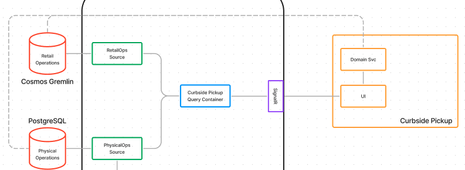
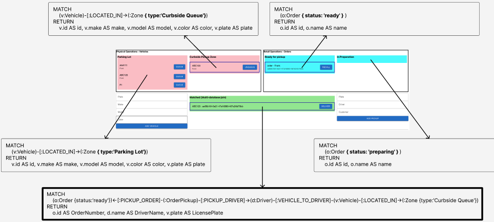

## Prerequsites
- [NodeJs](https://nodejs.org/)
- [Azure Functions Core Tools](https://learn.microsoft.com/en-us/azure/azure-functions/functions-run-local?tabs=v4%2Cmacos%2Ccsharp%2Cportal%2Cbash#install-the-azure-functions-core-tools)
- Azure Account
- Kubectl
- An instance of Reactive Graph, deployed to the Kubernetes cluster that your kubectl context points to
- The source repo cloned to a folder on your local machine


## Overview of the app

This demo consists of
  - 2 sources, each watching a different database
  - Several continuous queries against each database
  - A continuous query that joins across the 2 databases
  - A SignalR reaction that recieves changes and forwards them to any connected front end clients
  - An Azure Function App that provides Http endpoints that directly manuipulate the data in each database
  - A React frontend that invokes updates via the Function App and listens for changes via the SignalR reaction




## Setup a Gremlin Database

### Create a CosmosDb account

From the `/apps/curbside-pickup/devops` folder, use the Azure CLI to deploy `database.bicep`

```bash
az deployment group create -f database.bicep --resource-group <your resource group> -p cosmosAccountName=<your account name>
```

Insert your resource group name and pick a name for your CosmosDb account, for example:

```bash
az deployment group create -f database.bicep --resource-group my-resource-group -p cosmosAccountName=my-drasi-db
```

This will create a new CosmosDb account with the Gremlin API and a database named `Contoso` with 2 empty graphs, named `PhysicalOperations` and `RetailOperations`.

### Request FFCF feature

The FFCF feature is required to be enabled on your CosmosDb account.  Currently, this needs to be manually requested by [filling out this form](https://forms.office.com/pages/responsepage.aspx?id=v4j5cvGGr0GRqy180BHbR9ecQmQM5J5LlXYOPoIbyzdUOFVRNUlLUlpRV0dXMjFRNVFXMDNRRjVDNy4u)

### Add the Pickup zone data

Login to the Azure portal and navigate to the Data explorer blade of your CosmosDb account.

Expand the `Contoso/PhysicalOperations` Graph

Execute each of these Gremlin queries in the query box

```javascript
g.addV('Zone').property('name','Curbside Queue').property('type','Curbside Queue')
```

```javascript
g.addV('Zone').property('name','Parking Lot').property('type','Parking Lot')
```

## Deploy the sources

From the `/apps/curbside-pickup/devops` folder, edit the `phys-ops-source.yaml` and `retail-ops-source.yaml` files to include the keys/connections strings of your CosmosDb account.  The fields to update include `SourceAccountEndpoint`, `SourceKey` and `SourceConnectionString`, you can retrieve these values from the `Keys` blade in the Azure Portal.

Use kubectl to deploy the 2 sources

```bash
kubectl apply -f phys-ops-source.yaml
kubectl apply -f retail-ops-source.yaml
```

## Deploy the queries

From the `/apps/curbside-pickup/devops` folder, use kubectl to deploy the continuous queries

```bash
kubectl apply -f queries-with-gremlin.yaml
```

## Deploy the reaction

From the `/apps/curbside-pickup/devops` folder, use kubectl to deploy the SignalR reaction

```bash
kubectl apply -f signalr-reaction.yaml
```

Create a port forward for the SignalR reaction to a port on your local machine.

```bash
kubectl port-forward services/signalr1-gateway 5001:80 -n default
```

## Configure and start the App backend

From the `/apps/curbside-pickup/functions` folder, create a file named `local.settigns.json` and paste the following content, replacing the values for `RETAIL_OPS_URL`, `RETAIL_OPS_KEY`, `PHYSICAL_OPS_URL` and `PHYSICAL_OPS_KEY` with the values from the `Keys` blade in the Azure Portal from your CosmosDb account.

```json
{
  "IsEncrypted": false,
  "Values": {
    "FUNCTIONS_WORKER_RUNTIME": "node",
    "RETAIL_OPS_URL": "wss://<my-database>.gremlin.cosmos.azure.com:443/",
    "RETAIL_OPS_DB_NAME": "Contoso",
    "RETAIL_OPS_CNT_NAME": "RetailOperations",
    "RETAIL_OPS_KEY": "<access key>",
    "PHYSICAL_OPS_URL": "wss://<my-database>.gremlin.cosmos.azure.com:443/",
    "PHYSICAL_OPS_DB_NAME": "Contoso",
    "PHYSICAL_OPS_CNT_NAME": "PhysicalOperations",
    "PHYSICAL_OPS_KEY": "<access key>"
  },
  "Host": {
    "LocalHttpPort": 7071
  }
}
```
Install the dependencies.

```bash
npm install
```

Run the Functions app.

```bash
npm start
```

## Configure and start the App frontend

Double check the `config.json` file under `/app/src` to ensure the Urls are correct.

```json
{
  "crudApiUrl": "http://localhost:7071",  //Location of Functions app
  "signalRUrl": "http://localhost:5001/hub", //Location of SignalR port forward
  ...
}
```

From the `curbside-pickup/app` folder, start the react app

```bash
npm install
npm start
```

The front-end should be accessible at [http://localhost:3000](http://localhost:3000)

