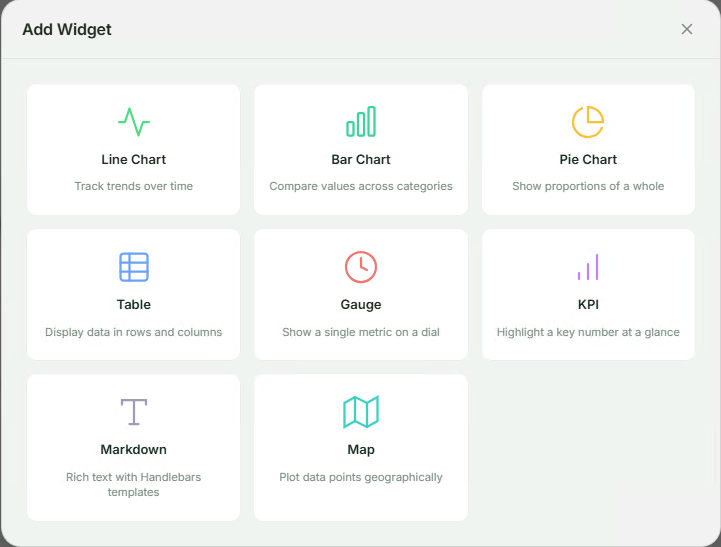
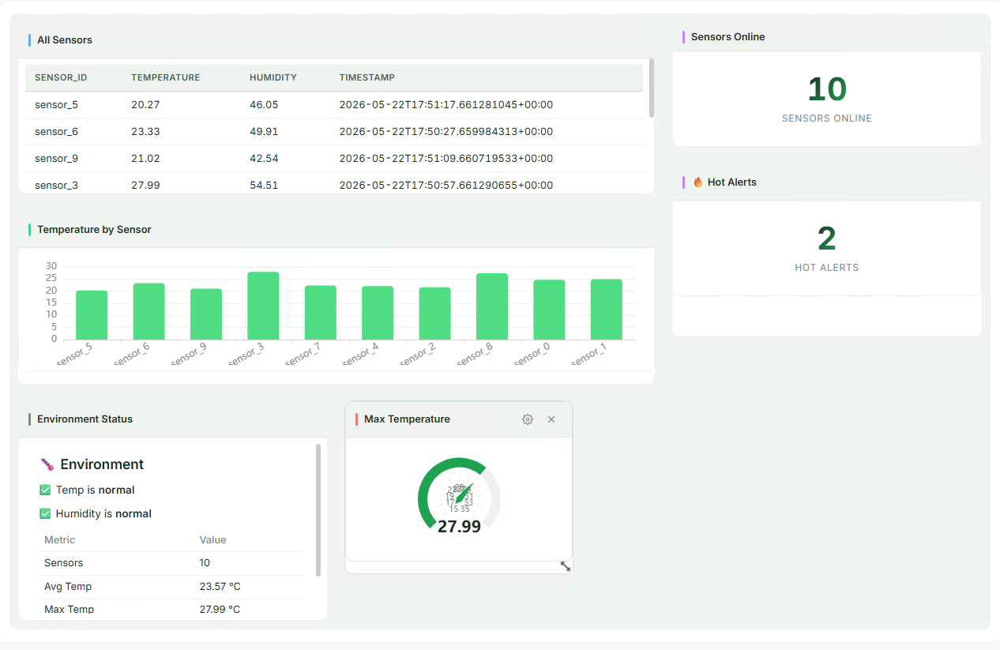

The Dashboard  serves an interactive web dashboard that visualizes query  in real time. It provides drag-and-drop layout, multiple widget types (charts, tables, KPIs, gauges, maps), and persists dashboard configurations via the state store.

## Basic Configuration

```yaml
reactions:
  - kind: dashboard
    id: my-dashboard
    queries: [sensor-query, alerts-query]
    port: 3000
```

This starts a dashboard web UI at `http://localhost:3000` that subscribes to the listed queries and displays real-time updates.

## User-Designed Dashboards

The dashboard reaction includes a full web-based designer that lets users create and customize dashboards interactively — no configuration file changes required. Once the reaction is running, open the dashboard URL in a browser to start building.

Users can add widgets by clicking the **Add Widget** button and choosing from the available widget types:



Each widget is configured through an intuitive form where you select the query, fields, and display options. Widgets can be repositioned and resized via drag-and-drop on the grid layout.

Here's an example of a user-designed IoT monitoring dashboard with tables, charts, KPIs, gauges, and markdown widgets — all created through the web UI:



Dashboard designs are automatically persisted to the state store, so they survive server restarts. Multiple users can access the same dashboard simultaneously and see real-time updates as query results change.

## Configuration Reference

| Field | Type | Default | Description |
|-------|------|---------|-------------|
| `kind` | string | Required | Must be `dashboard` |
| `id` | string | Required | Unique reaction identifier |
| `queries` | array | Required | Query IDs to subscribe to |
| `autoStart` | boolean | `true` | Start reaction automatically |
| `host` | string | `0.0.0.0` | Bind address for the HTTP + WebSocket server |
| `port` | integer | `3000` | Bind port |
| `heartbeatIntervalMs` | integer | `30000` | WebSocket heartbeat interval in milliseconds |
| `priorityQueueCapacity` | integer | None | Maximum pending change events in the priority queue; unbounded if not set |
| `predefinedDashboards` | array | `[]` | Dashboards seeded on first startup (see below) |

## Predefined Dashboards

You can ship dashboards as part of your configuration. Predefined dashboards are seeded into the state store on first startup. If a dashboard with the same ID already exists (e.g. the user modified it via the UI), it is **not** overwritten.

```yaml
reactions:
  - kind: dashboard
    id: my-dashboard
    queries: [sensor-query]
    port: 3000
    predefinedDashboards:
      - id: production-metrics
        title: "Production Metrics"
        grid:
          columns: 12
          rowHeight: 80
        widgets:
          - id: w-table
            widgetType: table
            title: "All Sensors"
            grid: { x: 0, y: 0, w: 8, h: 4 }
            config:
              queryId: sensor-query
              columns: [name, value, unit]
          - id: w-kpi
            widgetType: kpi
            title: "Sensor Count"
            grid: { x: 8, y: 0, w: 4, h: 2 }
            config:
              queryId: sensor-query
              valueField: name
              aggregation: count
              label: Sensors
```

## Widget Types

| Type | `widgetType` | Required Config Fields |
|------|-------------|------------------------|
| Table | `table` | `queryId`, `columns` (array of field names) |
| Bar Chart | `bar_chart` | `queryId`, `categoryField`, `valueFields` (array) |
| Line Chart | `line_chart` | `queryId`, `categoryField`, `valueFields` (array) |
| Pie Chart | `pie_chart` | `queryId`, `nameField`, `valueField` |
| Gauge | `gauge` | `queryId`, `valueField`, `min`, `max`, `aggregation` |
| KPI | `kpi` | `queryId`, `valueField`, `aggregation`, `label` |
| Text (Markdown) | `text` | `queryId`, `template` (Handlebars + Markdown) |
| Map | `map` | `queryId`, `latField`, `lngField`, `valueField` |

### Widget Grid Placement

Each widget has a `grid` object controlling its position and size in the 12-column layout:

| Field | Type | Description |
|-------|------|-------------|
| `x` | integer | Column position (0-based) |
| `y` | integer | Row position (0-based) |
| `w` | integer | Width in columns (1–12) |
| `h` | integer | Height in row units |

## Aggregation Modes

The `aggregation` field (used by KPI and Gauge widgets) controls how multiple rows are reduced to a single display value:

| Mode | Description |
|------|-------------|
| `last` | Last updated row (default) |
| `first` | First row in the result set |
| `sum` | Sum of all values in the field |
| `avg` | Average of all values |
| `min` | Minimum value |
| `max` | Maximum value |
| `count` | Number of rows |
| `filter` | Single row matching `filterField`/`filterValue` |

## Markdown Widget Templates

The Markdown (`text`) widget uses [Handlebars](https://handlebarsjs.com/) templates rendered as Markdown.

### Available Template Variables

| Variable | Description |
|----------|-------------|
| `rows` | Array of all result rows |
| `count` | Number of rows |
| `latest` | Last updated row |
| `aggregation` | Query-level aggregation value (if any) |

### Built-in Helpers

`sum`, `avg`, `min`, `max`, `count`, `format` (currency/percent/compact), `eq`, `gt`, `lt`, `gte`, `lte`.

### Example Template

```handlebars
## {{count}} sensors online

{{#each rows}}
- **{{this.name}}**: {{this.value}} {{this.unit}}
{{/each}}

Average reading: {{format (avg "value") "compact"}}
```

## HTTP API

The dashboard reaction exposes a REST API for managing dashboards:

| Method | Path | Description |
|--------|------|-------------|
| `GET` | `/` | Dashboard SPA (web UI) |
| `GET` | `/assets/*` | Static assets |
| `GET` | `/api/dashboards` | List all dashboards |
| `POST` | `/api/dashboards` | Create a new dashboard |
| `GET` | `/api/dashboards/:id` | Get dashboard by ID |
| `PUT` | `/api/dashboards/:id` | Update dashboard |
| `DELETE` | `/api/dashboards/:id` | Delete dashboard |
| `GET` | `/api/queries` | List subscribed queries |
| `GET` | `/api/queries/:id/snapshot` | Get current query snapshot |
| `GET` | `/ws` | WebSocket stream endpoint |

## WebSocket Protocol

The dashboard uses WebSocket for real-time updates. Connect to the `/ws` endpoint.

### Subscribe to Queries

```json
{ "type": "subscribe", "query_ids": ["sensor-query", "alerts-query"] }
```

### Receive Query Results

```json
{
  "type": "query_result",
  "query_id": "sensor-query",
  "timestamp": 1714500000000,
  "results": [
    { "op": "add", "data": { "name": "Sensor-1", "value": 42 } },
    { "op": "update", "before": { "name": "Sensor-1", "value": 42 }, "after": { "name": "Sensor-1", "value": 50 } },
    { "op": "delete", "data": { "name": "Sensor-1", "value": 50 } }
  ]
}
```

### Heartbeat

```json
{ "type": "heartbeat", "ts": 1714500000000 }
```

The server sends heartbeats at the configured `heartbeatIntervalMs` interval to keep connections alive.

## Examples

### Minimal Dashboard

```yaml
reactions:
  - kind: dashboard
    id: simple-dash
    queries: [my-query]
```

### IoT Monitoring Dashboard

```yaml
reactions:
  - kind: dashboard
    id: iot-monitor
    queries: [sensor-readings, device-alerts]
    port: 3000
    heartbeatIntervalMs: 15000
    predefinedDashboards:
      - id: iot-overview
        title: "IoT Overview"
        grid:
          columns: 12
          rowHeight: 80
        widgets:
          - id: sensor-table
            widgetType: table
            title: "All Sensors"
            grid: { x: 0, y: 0, w: 12, h: 4 }
            config:
              queryId: sensor-readings
              columns: [id, name, temperature, humidity, last_seen]
          - id: temp-gauge
            widgetType: gauge
            title: "Avg Temperature"
            grid: { x: 0, y: 4, w: 4, h: 3 }
            config:
              queryId: sensor-readings
              valueField: temperature
              min: 0
              max: 100
              aggregation: avg
          - id: alert-count
            widgetType: kpi
            title: "Active Alerts"
            grid: { x: 4, y: 4, w: 4, h: 3 }
            config:
              queryId: device-alerts
              valueField: id
              aggregation: count
              label: "Alerts"
          - id: temp-chart
            widgetType: line_chart
            title: "Temperature Trend"
            grid: { x: 8, y: 4, w: 4, h: 3 }
            config:
              queryId: sensor-readings
              categoryField: name
              valueFields: [temperature]
```

### Order Tracking Dashboard

```yaml
reactions:
  - kind: dashboard
    id: orders-dash
    queries: [pending-orders, order-stats]
    port: 3001
    predefinedDashboards:
      - id: order-tracking
        title: "Order Tracking"
        grid:
          columns: 12
          rowHeight: 80
        widgets:
          - id: orders-table
            widgetType: table
            title: "Pending Orders"
            grid: { x: 0, y: 0, w: 8, h: 5 }
            config:
              queryId: pending-orders
              columns: [id, customer_name, total, status, created_at]
          - id: order-total-kpi
            widgetType: kpi
            title: "Total Value"
            grid: { x: 8, y: 0, w: 4, h: 2 }
            config:
              queryId: pending-orders
              valueField: total
              aggregation: sum
              label: "Pending $"
          - id: order-count-kpi
            widgetType: kpi
            title: "Order Count"
            grid: { x: 8, y: 2, w: 4, h: 2 }
            config:
              queryId: pending-orders
              valueField: id
              aggregation: count
              label: "Orders"
          - id: status-pie
            widgetType: pie_chart
            title: "By Status"
            grid: { x: 8, y: 4, w: 4, h: 3 }
            config:
              queryId: order-stats
              nameField: status
              valueField: count
```

## Complete Example

```yaml
host: 0.0.0.0
port: 8080
logLevel: info

stateStore:
  kind: redb
  path: ./data/state.redb

sources:
  - kind: postgres
    id: sensors-db
    host: ${DB_HOST}
    port: ${DB_PORT:-5432}
    database: ${DB_NAME}
    user: ${DB_USER}
    password: ${DB_PASSWORD}
    tables:
      - public.sensors
      - public.alerts

queries:
  - id: all-sensors
    query: |
      MATCH (s:sensors)
      RETURN s.id, s.name, s.temperature, s.humidity, s.last_seen
    sources:
      - sourceId: sensors-db

  - id: high-temp-alerts
    query: |
      MATCH (s:sensors)
      WHERE s.temperature > 80
      RETURN s.id, s.name, s.temperature
    sources:
      - sourceId: sensors-db

reactions:
  - kind: dashboard
    id: sensor-dashboard
    queries: [all-sensors, high-temp-alerts]
    port: 3000
    heartbeatIntervalMs: 15000
    priorityQueueCapacity: 10000
    predefinedDashboards:
      - id: sensor-overview
        title: "Sensor Overview"
        grid:
          columns: 12
          rowHeight: 80
        widgets:
          - id: all-sensors-table
            widgetType: table
            title: "All Sensors"
            grid: { x: 0, y: 0, w: 12, h: 4 }
            config:
              queryId: all-sensors
              columns: [name, temperature, humidity, last_seen]
          - id: avg-temp
            widgetType: gauge
            title: "Average Temperature"
            grid: { x: 0, y: 4, w: 4, h: 3 }
            config:
              queryId: all-sensors
              valueField: temperature
              min: 0
              max: 120
              aggregation: avg
          - id: alert-kpi
            widgetType: kpi
            title: "High Temp Alerts"
            grid: { x: 4, y: 4, w: 4, h: 3 }
            config:
              queryId: high-temp-alerts
              valueField: id
              aggregation: count
              label: "Alerts"
          - id: summary-text
            widgetType: text
            title: "Summary"
            grid: { x: 8, y: 4, w: 4, h: 3 }
            config:
              queryId: all-sensors
              template: |
                ## {{count}} sensors reporting

                Average temp: {{format (avg "temperature") "compact"}}°F
```

## Docker Configuration

Map the dashboard port when running in Docker:

```yaml
# docker-compose.yml
services:
  drasi-server:
    image: ghcr.io/drasi-project/drasi-server:latest
    ports:
      - "8080:8080"   # REST API
      - "3000:3000"   # Dashboard UI
```

## Limitations

- No built-in authentication (single-user assumption in v1)
- After a WebSocket reconnect, clients must rebuild their state from a fresh snapshot — there is no server-side replay or backfill of missed events
- Map widget uses scatter coordinates unless ECharts geo map data is registered


The dashboard reaction does not include authentication or TLS. Do not expose the dashboard port directly to the public internet. In production, place it behind a reverse proxy or ingress controller that provides authentication, TLS termination, and network access restrictions.


## Documentation resources

<div class="card-grid card-grid--2">
  <a href="https://github.com/drasi-project/drasi-core/blob/main/components/reactions/dashboard/README.md" target="_blank" rel="noopener">
    <div class="unified-card unified-card--tutorials">
      <div class="unified-card-icon"><i class="fab fa-github"></i></div>
      <div class="unified-card-content">
        <h3 class="unified-card-title">Dashboard Reaction README</h3>
        <p class="unified-card-summary">Widget types, API, WebSocket protocol, and integration tests</p>
      </div>
    </div>
  </a>
  <a href="https://crates.io/crates/drasi-reaction-dashboard" target="_blank" rel="noopener">
    <div class="unified-card unified-card--howto">
      <div class="unified-card-icon"><i class="fas fa-box"></i></div>
      <div class="unified-card-content">
        <h3 class="unified-card-title">drasi-reaction-dashboard on crates.io</h3>
        <p class="unified-card-summary">Package info and release history</p>
      </div>
    </div>
  </a>
</div>

## Next steps

- [Configure SSE Reaction](/drasi-server/how-to-guides/configuration/configure-reactions/configure-sse-reaction/)
- [Configure HTTP Reaction](/drasi-server/how-to-guides/configuration/configure-reactions/configure-http-reaction/)
- [Configure Log Reaction](/drasi-server/how-to-guides/configuration/configure-reactions/configure-log-reaction/)
