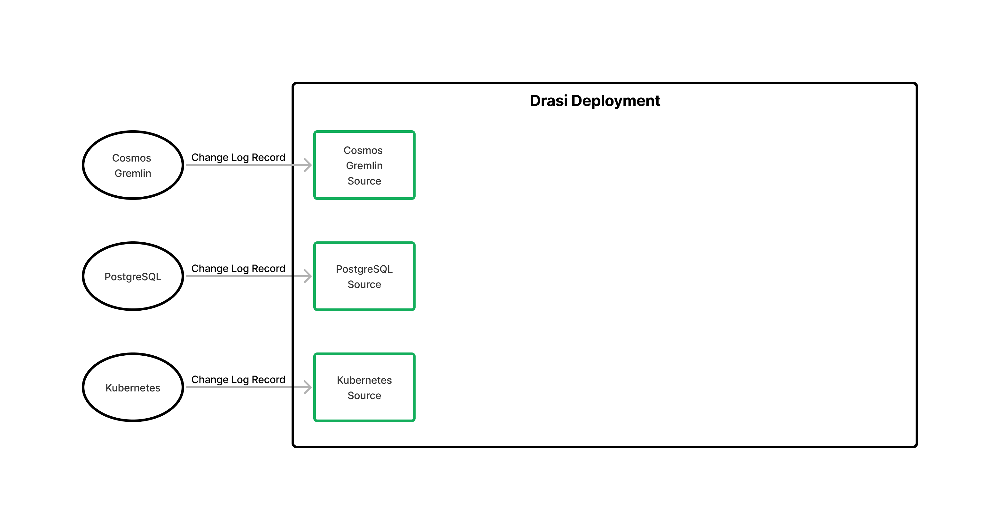
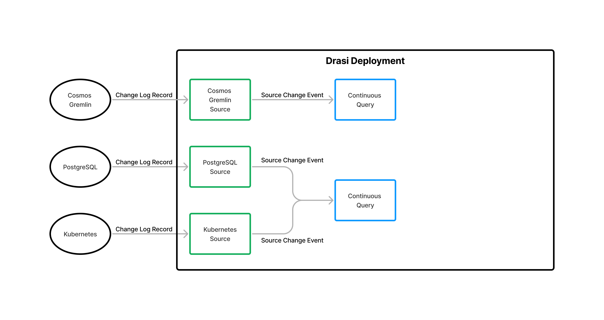
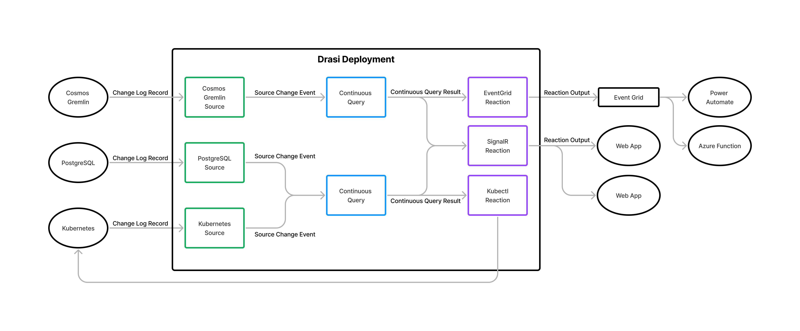

Being able to react dynamically when data changes in business systems is increasingly important to organizations that want to improve productivity and operational efficiency through the creation of more integrated and responsive software solutions.

We believe the ability to observe systems, detect changes in data, and react dynamically to those changes is fundamentally too hard using current practices and technologies and is an area that is ready for disruption. 

Instead of requiring highly skilled developers experienced in data modeling, event-driven architectures, and messaging infrastructure to build bespoke solutions that detect and react to changes as part of your business solutions, we believe a platform approach using continuous queries to detect change and feed those changes to low-code components for processing can significantly reduce the complexity, cost, and time to build future dynamic software solutions.

## Project Drasi
Drasi is a **Data Change Processing** platform that makes it easier to build dynamic solutions that detect and react to change in data from multiple source systems. Drasi is built around three simple components: **Sources**, **Continuous Queries**, and **Reactions**. 

 

A single Drasi environment can host many Sources, Continuous Queries, and Reactions, composing them together to build scalable Data Change Processing capabilities to power dynamic business solutions. 

### Sources
Sources provide connectivity to the systems that Drasi can observe as sources of change. These are often relational or graph databases in which the system of interest stores its data. But Sources can be implemented for any system that provides a low-level change feed and a way to query the current state of the system. 

 

Drasi’s Source input schema is modeled on Debezium (https://debezium.io), an open-source Change Data Capture platform that has adapters for many common data sources. By embracing the open data standard defined by Debezium, Drasi will be able to use many existing Debezium sources as input. 

### Continuous Queries
Continuous Queries, expressed in [Cypher Query Language](https://neo4j.com/developer/cypher/), process change events from one or more Sources and evaluate each change to determine if it affects the Continuous Query’s result. If so, the Continuous Query determines exactly which result elements have been added, updated, and deleted, and distributes the changes to all Reactions that have subscribed to the Continuous Query.

 

### Reactions
Reactions receive a stream of query result changes generated by one or more Continuous Queries and take action. Drasi provides standard Reactions that:
- forward the query result updates to Azure Event Grid or SignalR so they can be processed by solution specific code in applications, services, and functions.
- use the query result updates as input to configurable Stored Procedures and Gremlin commands to update databases without the need to integrate with additional intermediary software services.

 

Creating custom Reactions to run in the Drasi environment is also possible.

## Benefits
Drasi provides significant benefits over existing change event/notification approaches, including:
- Continuous Queries are written as declarative graph queries using the Cypher Query Language, making them easy to write, while supporting a rich and expressive syntax. Using a single query, you describe the changes you want to detect, and the data you want to capture to describe when those changes occur.
- Continuous Queries are graph queries, allowing you to write queries that walk relationships that exist between connected data elements or which aggregate data across a set of connected elements. 
- Continuous Queries can incorporate data from multiple sources, even if the data from those sources has no natural connection and uses different data schema. For example, data both a Gremlin database and a PostgreSQL database could be used in a single query.
- Out of the box support for multiple source systems including Azure Cosmos Gremlin API, PostgreSQL, and Kubernetes. 
- Integration with the rich Change Data Capture ecosystem provided by the open source Debezium project.
- Out of the box Reactions include support for the following:
  - forwarding changes to Azure Event Grid so you can integrate easily with PowerPlatform functionality as well as bespoke applications, services, and functions.
  - forwarding changes to SignalR so you can integrate easily with Web Applications and use real-time output from Continuous Queries to drive application UIs.
  - use the changes to automatically execute commands and stored procedures on source databases
- The ability to write custom Reactions that process the output of Continuous Queries means you can easily customize the change handling functionality provided by Drasi.

## Getting Started
The next step depends on what you want to do...

- If you are interested in **discussing** Drasi, having a **demonstration**, or getting access to a live demo environment so you can **explore** solutions built using Drasi, email [Allen Jones (alljones)](mailto:alljones@microsoft.com).

- If you are a **developer** that wants to **use** Drasi in a solution you are creating, go to the [Solution Developer Guides](/solution-developer).

- If you are a **developer** that wants to **contribute** to Drasi or **create custom extensions** for Drasi, go to the [Platform Developer Guides](/platform-developer).

- If you want to **deploy** a Drasi environment of your own or **manage** an existing environment, go to the [Administrator Guides](/administrator)