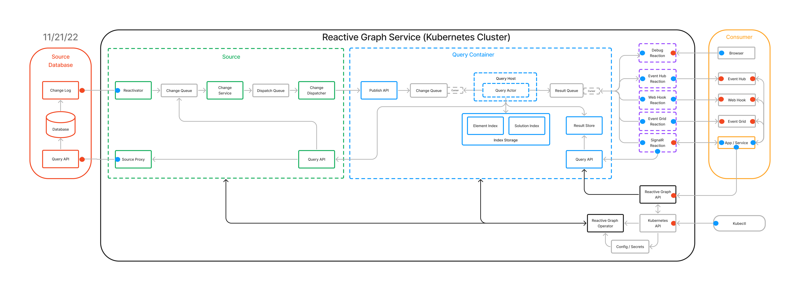

The following diagram shows the end-to-end service-level architecture of Reactive Graph.

 

Reactive Graph is deployed to a Kubernetes cluster as a Kubernetes operator which deploys and manages a set of custom resources. The custom resources shown in the diagram include:
-	Source (green), which provides bi-directional connectivity to data sources.
-	Query Container (blue), which hosts one or more Continuous Queries and provides the persistent store in which the Continuous Queries store their indexes.
-	Reaction (purple), which receives and processes Continuous Query result updates.

There can be multiple Sources, Query Containers, and Reactions configured in a Reactive Graph installation.  Of note:
-	Individual services (depicted as small colored rectangles) are written in Node.js or C# and use dapr for service discovery and invocation, pubsub, and state management.
-	The Query Host is a dapr actor host and will host multiple Continuous Queries that are implemented as dapr actors.
-	The persistent index / result store in the Query Container is currently Mongo DB, but we are actively evaluating alternatives such as Garnet. 
-	The small grey boxes represent messaging infrastructure that is abstracted by dapr. Currently we use Kafka for messaging.
-	The Reactive Graph Operator is written in Go.
-	Red dots indicate Auth boundaries enforced using JWT and blue dots indicate locations where credentials need to be securely stored. Secrets within Reactive Graph are stored using the secrets management capabilities provided by Kubernetes. 

The Source Database (red rectangle) to the left of the diagram represents data sources that feed Reactive Graph. The Consumer (orange rectangle) to the right of the diagram represents consumer applications and the messaging infrastructure that exist to receive change notifications from Reactive Graph. These databases, applications, and infrastructure services are outside the control of Reactive Graph.

A more detailed description of the Reactive Graph architecture is provided in Appendix B. 
