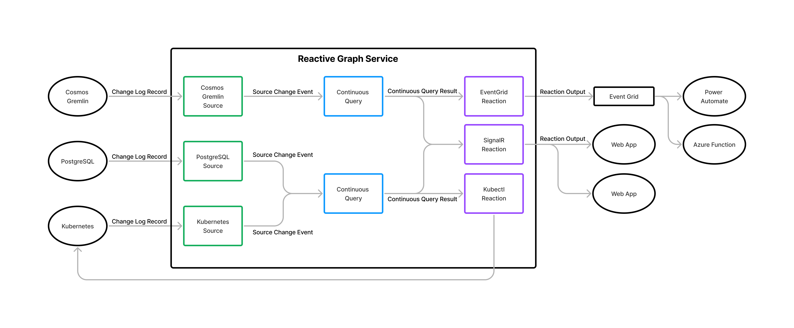

**The Reactive Graph Preview is a prototype and is only suitable for experimentation, not for production systems.**

## Context
The world is complex and constantly changing. Organizations create ever more sophisticated software systems in an effort to model, reason about, and manage their physical assets and operational activities.  Examples of highly complex software systems are common in domains like:
- Enterprise Resource Planning
- Supply Chain Management
- Logistics and Transportation
- Facilities Management
- Manufacturing Control

The data managed by these software systems can be large and complex, in some instances containing millions of digital entities that represent real-world things like people, vehicles, products, orders, processes, and incidents. These systems can also contain millions of relationships between entities that describe how things in the real world are physically or logically related to each other, for example:
- a Car is made from a set of Sub-Assemblies that are made from Components
- a Team includes a collection of Members that are People

Because the world is constantly changing, the digital representations of real-world things must also change. In software systems, this results in the continual creation and deletion of entities, modifications to the properties that represent the state of the entities, and the creation and deletion of relationships between entities. In large systems, the frequency and volume of change can be very high.

There exist a variety of architectural approaches and technologies to meet the scale and performance requirements of such software systems with respect to the representation, storage, modification, and retrieval of data. But being able to react dynamically when this data changes is increasingly important to organizations that want to improve productivity and operational efficiency through the creation of more integrated and responsive software solutions.

**We believe, the ability to observe source systems, detect specific changes, and react dynamically to those changes is fundamentally too hard and is an area that is ready for disruption.**

## The Problem
Some software systems are designed with built-in change notification capabilities that enable cascading updates within the system or external consumers to observe changes as they occur and react accordingly. But building such systems is difficult and time consuming. For example, if you want to include change notification capabilities in a system you are building, you will need to decide:
- Which actions or operations in your system generate events (i.e an event taxonomy). For a large system there could be hundreds or thousands of actions for which you need to generate events.
- What data to use to describe those changes (i.e. an event schema). This could be very generic using a single schema for all events, or require different schema for different event types.
- Which components and services in your system will generate events and under what circumstances.
- How to distribute the events reliably and efficiently at a scale to meet expected consumer demands.
- How to enable consumer systems to register interest in the events your system generates. The more flexible you make this, by supporting filters and rich query capabilities, the more complex it becomes.
- How to secure your system so that the events you are generating are only accessible to authorized consumers.
- How to test the event generation and distribution.
- How to monitor the eventing functionality and supporting infrastructure in production.
- How to educate developers in the use of your eventing capabilities and make it easy for them to use.

Doing all this successfully (in addition to delivering the system’s primary functionality) requires the developer to have good data modelling skills, a deep understanding of event driven architectures, and experience with messaging infrastructure technology. All of this is in addition to skills in their domain of expertise, like financial services or life sciences. As such, many systems do not include change notification capabilities, or have very simplistic implementations that provide limited value to the developers trying to use them.

Further, observing and reacting to software systems that were not originally designed to generate change notifications presents additional challenges for developers. While the developer still needs to address all the concerns outlined previously, they must also solve the problem of detecting when changes occur in the source systems. If they are unable to modify the system source code to update components and services to generate change notifications, as is often the case when dealing with third-party or legacy systems, the developer must implement a complex and inefficient work around such as:
- periodically querying (i.e. polling) the source system and comparing results to detect changes over time.
- processing the source change feed and determining, often with complex logic, which low-level changes are relevant.

While there are established patterns and technologies that help developers deal with each of these challenges, the knowledge, skills, and time taken to implement them effectively at scale are beyond the capabilities of many people and organizations. 

## The Solution
Reactive Graph is a **Data Change Detection and Response** infrastructure that makes it easier to build dynamic solutions that observe and react to change in source systems. As illustrated in the diagram below, Reactive Graph processes change logs from source systems and enables you to run Continuous Queries across the changing data. When changes occur that affect the Continuous Query result, Reactive Graph pushes the result updates to one or more Reactions that are subscribed to the Continuous Query. These Reactions can act on the updates themselves, use them to update a source system, or forward the updates to your apps and services for processing.

 

Reactive Graph provides capabilities that most existing change event/notification solutions do not, including:
- The ability to use Continuous Queries, which are rich declarative graph queries written in the Cypher Query Language, to both describe the changes you want to detect and the way you want to describe those changes. 
- The ability to write Continuous Queries that incorporate data from multiple sources, even if the data from those sources has no natural connection and uses different data schema.
- Out of the box support for multiple source systems including Azure Cosmos Gremlin API, PostgreSQL, and Kubernetes. And integration with the rich Change Data Capture ecosystem provided by the open source Debezium project.
- Out of the box Reactions that use Continuous Query result updates to run commands on source systems, or forward them using existing messaging infrastructure such as Azure Event Grid.
- The ability to write custom Reactions (and Sources in the future).

## Why use Reactive Graph?
As a Solution Developer, there are multiple approaches you can take to use Reactive Graph depending on what you need to achieve and how you choose to model the data and services in your solution. When starting to learn how to use Reactive Graph, it can be useful to think in terms of the following 3 increasingly sophisticated approaches:
1. **Observing Changes**, where you use Reactive Graph to detect the creation, modification, or deletion of data elements in one or more source systems and take some action in response to those changes.
1. **Observing Conditions**, where you use Reactive Graph to detect when changes in one or more source systems cause some pre-defined condition to be met and take some action in response.
1. **Observing Collections**, where you use Reactive Graph to define collections of data elements that meet some criteria, and you use those collections and the changes to those collections over time to drive your solution behavior.

Each of these approaches is described in more detail in the [Solution Developer Guides](/solution-developer/). However, it is important to understand that the only difference in these approaches is the degree to which you embrace the capabilities of Reactive Graph. The more sophisticated approaches often require you to include more sources and/or write richer queries, but they also allow you to push more responsibility onto Reactive Graph, meaning you write and maintain less code.

The 3 approaches above are focused on the observation of data from an existing source system were your solution is the consumer. You might also consider Reactive Graph if you are creating a solution that you expect other systems will need to observe for change. 

Under such circumstances, you might consider Reactive Graph as an alternative to implementing your own eventing solution. Just as most people do not implement their own database, messaging solution, or web framework, using Reactive Graph means you do not need to implement your own Change Detection and Response solution. Instead, as part of your overall solution, you could provision a Reactive Graph deployment and instruct downstream developers to use it to observe and react to changes from your system. You are freed from a great deal of work and the downstream developers get a richer and more flexible way to observe your system.

## Why NOT use Reactive Graph?
There are, of course, situations where it does not make sense to use Reactive Graph, or where you need to carefully consider the benefits and disadvantages of other alternatives. Some of these situations are related to the current experimental status of Reactive Graph but some are related to the challenges or complexities of specific environments or data models. Here are a few examples:

- The Reactive Graph Preview is a prototype and is only suitable for experimentation, not for production systems. This will change over time as Reactive Graph matures.
- If a source system already has a mature change notification capability, it might be a more suitable choice. This is particularly true if the system's underlying data model is extremely complicated and the events it generates significantly abstract the complexity away from the consumer. It might be easier to consume the in-built events and/or the in-built eventing mechanism might be optimized for the systems data-model.
- When you need to take action when something didn't happen. Reactive Graph relies on changes in source systems to activate it, if something doesn't happen, there is no trigger.