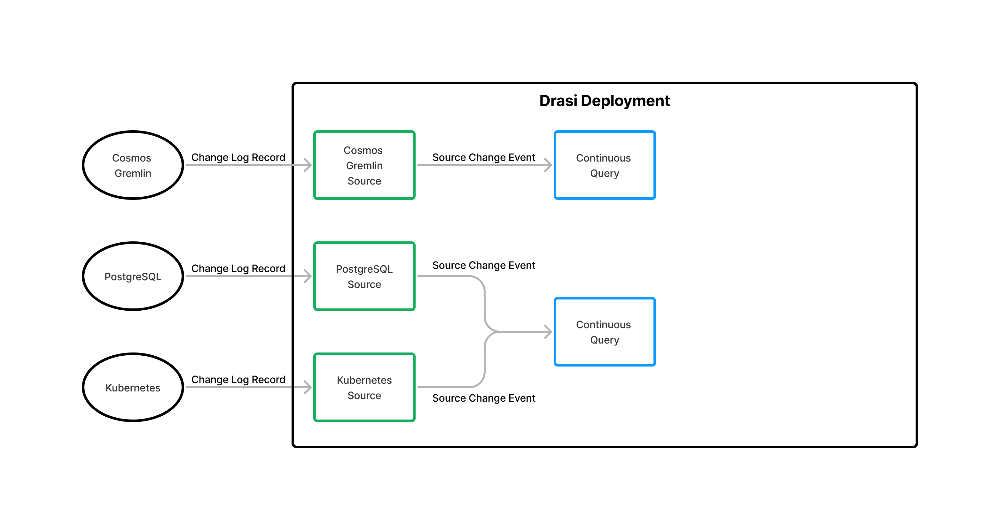
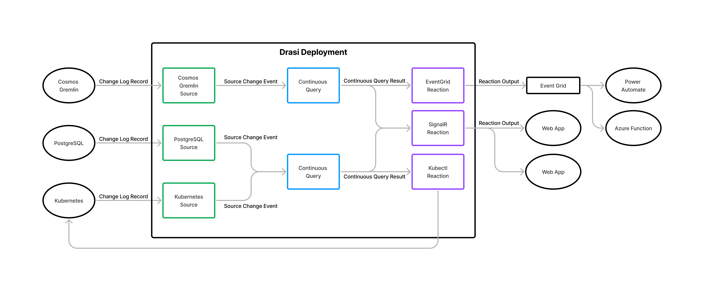

The world is complex and constantly changing. Organizations create ever more sophisticated software systems in an effort to model, reason about, and manage their physical assets and operational activities. The data managed by these software systems can be large and complex, in some instances containing millions of digital entities that represent real-world things like people, vehicles, products, orders, processes, and incidents. These systems can also contain millions of relationships between entities that describe how things in the real world are physically or logically related to each other

As the world changes, the data must also change, resulting in the continual creation and deletion of entities, modifications to the properties that represent the state of the entities, and the creation and deletion of relationships between entities. In large systems, the frequency and volume of change can be very high. 

Being able to react dynamically when this data changes is increasingly important to organizations that want to improve productivity and operational efficiency through the creation of more integrated and responsive software solutions across and between organizations.

**We believe, the ability to observe systems, detect changes, and react dynamically to those changes is fundamentally too hard and is an area that is ready for disruption.**

## Project Drasi
Drasi is a **Data Change Processing** platform that makes it easier to build dynamic solutions that detect and react to change in data from multiple source systems. Drasi is built around three simple components: **Sources**, **Continuous Queries**, and **Reactions**. 

 

A single Drasi environment can host many Sources, Continuous Queries, and Reactions, composing them together to build scalable Data Change Processing capabilities to power dynamic business solutions. 

### Sources
Sources provide connectivity to the systems that Drasi can observe as sources of change. These are often relational or graph databases in which the system of interest stores its data. But Sources can be implemented for any system that provides a low-level change feed and a way to query the current state of the system. 

 

Drasi’s Source input schema is modeled on Debezium (https://debezium.io), an open-source Change Data Capture platform that has adapters for many common data sources. By embracing the open data standard defined by Debezium, Drasi will be able to use many existing Debezium sources as input. 

### Continuous Queries
Continuous Queries, expressed in [Cypher Query Language](https://neo4j.com/developer/cypher/), process change events from one or more Sources and evaluate each change to determine if it affects the Continuous Query’s result. If so, the Continuous Query determines exactly which result elements have been added, updated, and deleted, and distributes the changes to all Reactions that have subscribed to the Continuous Query.

 

### Reactions
Reactions receive a stream of query result changes generated by one or more Continuous Queries and take action. Drasi provides standard Reactions that:
- forward the query result updates to Azure Event Grid or SignalR so they can be processed by solution specific code in applications, services, and functions.
- use the query result updates as input to configurable Stored Procedures and Gremlin commands to update databases without the need to integrate with additional intermediary software services.

 

Creating custom Reactions to run in the Drasi environment is also possible.

### Benefits
Drasi provides capabilities that most existing change event/notification solutions do not, including:
- The ability to use Continuous Queries, which are rich declarative graph queries written in the Cypher Query Language, to both describe the changes you want to detect and the way you want to describe those changes. 
- The ability to write Continuous Queries that incorporate data from multiple sources, even if the data from those sources has no natural connection and uses different data schema.
- Out of the box support for multiple source systems including Azure Cosmos Gremlin API, PostgreSQL, and Kubernetes. And integration with the rich Change Data Capture ecosystem provided by the open source Debezium project.
- Out of the box Reactions that use Continuous Query result updates to run commands on source systems, or forward them using existing messaging infrastructure such as Azure Event Grid.
- The ability to write custom Reactions (and Sources in the future).