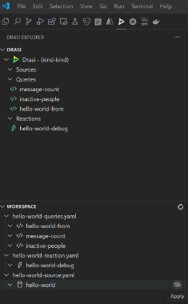
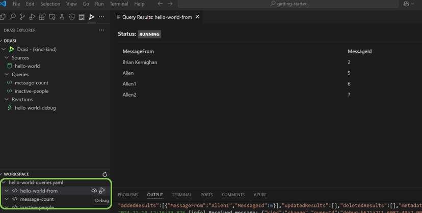

The **Drasi Visual Studio Code extension** integrates with the Drasi platform, enabling developers to manage Drasi resources as well as test and debug Continuous Queries directly within the editor.

## Installation

The Drasi VS Code extension is available for download and installation from the [Visual Studio Marketplace](https://marketplace.visualstudio.com/items?itemName=DrasiProject.drasi). You can search for the Drasi extension and install it from within VS Code. For this, bring up the Extensions view by clicking on the Extensions icon in the Activity Bar on the side of VS Code or the View: Extensions command (⇧⌘X for Mac, Ctrl+Shift+X for Windows).

## Usage

Once the extension is installed, the `Drasi Explorer` view will be visible in the Activity Bar. The extension scans your workspace directory for YAML files that contain Drasi resources (Sources, Continuous Queries, and Reactions) and displays them in the Workspace tab.

 Resources can be deployed using the Apply option available in the Workspace tab.

Additionally, queries can be validated using the Debug option.

An important capability of the Drasi Explorer is its ability to attach a deployed query and display real-time updates for it. The result set automatically updates when new data arrives and can be viewed within VS Code in dedicated panel. Choose the Attach option for this.

