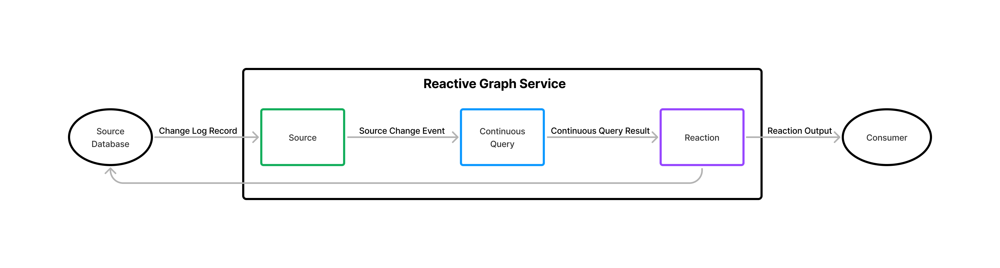

**The Reactive Graph Preview is a prototype and is only suitable for experimentation, not for production systems.**

## Why Use Reactive Graph?
The goal of Reactive Graph is to make it easier to build dynamic solutions that observe and react to change in source systems. Reactive Graph enables this by processing change streams from source systems and allowing you to run Continuous Queries across the changing data. When changes occur that affect the Continuous Query result, Reactive Graph pushes the changes to one or more Reactions that are subscribed to the Continuous Query. These Reactions can act on the updates themselves, use them to update a source system, or forward the updates to your apps and services for processing.

 

As a Solution Developer, there are multiple approaches you can take to use this functionality depending on what you need to achieve and how you choose to model the data in your solution. When starting to learn how to use Reactive Graph, it can be useful to think in terms of the following 3 increasingly sophisticated approaches:
1. **Observing Changes**, where you use Reactive Graph to detect the creation, modification, or deletion of data elements in one or more source systems and take some action in response to those changes.
1. **Observing Conditions**, where you use Reactive Graph to detect when changes in one or more source systems cause some condition to be met and take some action in response to that condition.
1. **Observing Collections**, where you use Reactive Graph to define collections of data elements that meet some criteria, and you use those collections and the changes to those collections (in response to source system changes) to drive your solution.

Each of these approaches is described in more detail below. However, it is important to understand that the only difference in these approaches is the degree to which you embrace the capabilities of Reactive Graph. The more sophisticated approaches allow you to push more responsibility onto Reactive Graph, allowing you to write and maintain less code.

The 3 approaches above are focused on the observation of data from an existing source system were your solution is the consumer. You might also consider Reactive Graph if you are creating a solution that you expect other systems will need to observe for change. For example, if you are building an Order management system, you might want to generate events when orders are placed or cancelled so that other systems in your business can take some action.

Typically, if you are building such a system, you will need to decide:
- Which actions or operations in your system generate events (i.e an event taxonomy). For a large system there could easily be hundreds of actions you need to generate events for.
- What data to use to describe those changes (i.e. an event schema). This could be very generic using a single schema for all events, or have different schema for different event types.
- Which components and services in your system will generate events and under what circumstances.
- How to distribute the events reliably and efficiently at a scale to meet expected consumer demands.
- How to allow consumer systems to express interest in the events your system generates. The more flexible you make this to support filters and queries, the more complex it becomes.
- How to secure your system so that the events you are generating are only accessible to authorized systems.

In all, this is a great deal of work to design, implement, and maintain and requires a deep understanding of data modeling and messaging infrastructure.

Under such circumstances, you might consider Reactive Graph as an alternative to implementing your own eventing solution. Just as most people do not implement their own database, messaging solution, or web framework, Reactive Graph means you do not need to implement your own Change Detection and Distribution solution. As part of your overall solution, you could provision a Reactive Graph deployment and instruct downstream developers to use it to observe and react to changes from your system. You are freed from a great deal of work, and the consumer developers get a richer and more flexible solution.

## When to Use Reactive Graph?
The previous section called out 3 high-level approaches to using Reactive Graph:

1. Observing Changes
1. Observing Conditions
1. Observing Collections

The following sections explore each of these in more detail and provide examples. 

### Observing Changes
Most systems that provide the capability for you as a Solution Developer to observe and react to change do so by propagating events (sometimes called notifications) that describe the creation, deletion, or update to some data entity that is modelled in the system. For example: 
- a Retail Operations system might generate events related to:
  - Orders
  - Products
  - Customers
  - Deliveries
  - Invoices
- a Human Resources system might generate events related to:
  - Employees
  - Teams
  - Contractors

Database change logs are an obvious examples of this approach; they simply output the details of the entity/record that was created, updated, or deleted. It is the responsibility of the consumer to decide what to do with those changes, including which events can be ignored and which to process.

But this is also the approach with many systems. Although they may contain events that are more related to the domain (not dependent on the underlying data model), the events are often of a fixed schema and represent a single change to a single element.

Reactive Graph can be used to handle this simple case by:
1. Creating a Source to handle the source
2. Creating a Continuous Query that describes the elements you want
3. Reactions

The CQ in this instance would be very somple:

```
MATCH [:Order]
```

But if you wanted to resshape the output, it is a s simple as:

```
MATCH [o:Order]
RETURN 
  o.id AS OrderNumber,
  o.customerId AS CustomerId
  o.total AS OrderTotal
```


### Observing Conditions
More flexible systems allow consumers greater control over which events they received, this is often done using filters or rules. The consumer only reveis events that match the rules criteria. 

In RG you have the ability to specify 
- graph
- properties
- connects that dont exist in the source data
- aggregates

### Observing Collections
Each time a Source propagates a change into Reactive Graph, the change is evaluated by each Continuous Query and the impact of the change on the query result is calculated. This means at any point in time, each Continuous Query has an accurate result, and for each change the COntinuous Query generates a descriptions of exactly which result elements where added, updated, or deleted.

As a Solution Developer, this enables you to think in terms of dynamic collections defined using rich declarative queries that you can incorporate into your solution.

It might help to think of these as 
For example, 


## How to Use Reactive Graph?
Now you understand **why** and **when** to use Reactive Graph, **how** to use Reactive Graph is a simple matter of doing the following:

1. [Define Sources](/solution-developer/sources) for each of the source databases over which you want to run Continuous Queries.
1. [Define Continuous Queries](/solution-developer/continuous-queries) for each of the queries you want to run across those databases.
1. [Define Reactions](/solution-developer/reactions)  to handle the output from each of your Continuous Queries.

## Why NOT use Reactive Graph
There are circumstances where it does not make sense to use Reactive Graph. Some of these are related to the current experimental state of Reactive Graph and some are related to the challenges or complexities of specific environments. Here are a few possibilities:

- The Reactive Graph Preview is a prototype and is only suitable for experimentation, not for production systems. This will change over time as Reactive Graph matures.
- If a source system already has a mature change notification capability, it might be a more suitable choice, especially if it the systems underlying data model is extremely complicated and the events it generates abstract that away from the consumer, this is often the case in complex ERP and manufacturing solutions.
- When you need to take action when something didn't happen. Reactive Graph relies on changes in source systems to activate it, if something doesn't happen, there is no trigger.
- TODO - more