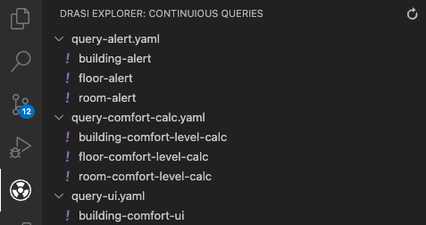

The VS Code extension enables you to rapidly test the validity of your continuous queries by providing a one click `Run` button that will bootstap, execute and display the results/errors of queries within your VS Code workspace.

## Installing

Download the VS Code extension from https://drasi.blob.core.windows.net/installs/drasi-0.0.1.vsix
Open the VS Code command palette and run the `Extensions: Install from VSIX` command and select the `drasi-0.0.1.vsix` from your download location.

## Usage

Before some of the features can be used, you need to install the dev tools to your Drasi deployment.  To do this, ensure your Kubernetes context is pointing to your Drasi instance, open the VS Code command palette and run the `Drasi: Deploy dev tools` command.

Once the extension is installed, the `Drasi Explorer` view should be visible in the Activity Bar.  This will scan your workspace for YAML files that contain continuous queries and enable you to execute them once off against your Drasi instance.  You will need to manually deploy any source(s) the your queries depend upon.

