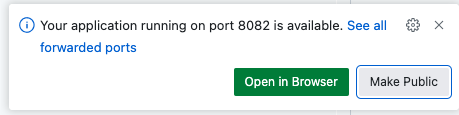

## Prerequisites

This tutorial continues from the [getting started tutorial](../../getting-started).  If you have not completed that tutorial, please do so before continuing.


## Deploy the SignalR Reaction

The first step is to deploy the SignalR Reaction.  This will forward the results of a query to a SignalR hub.  This will allow a front end application to connect to the SignalR hub and receive the results of the query in real time.

This is the Reaction definition that we will use, it will forward the results of the `hello-world-from` query to a SignalR hub.

```yaml
apiVersion: v1
kind: Reaction
name: hello-world-signalr
spec:
  kind: SignalR
  queries:
    hello-world-from:
```

This Reaction definition can be found in the `02-connect-frontends` directory in the `signalr-reaction.yaml` file.
Navigate to the `02-connect-frontends` directory and deploy the SignalR Reaction.

```shell
cd 02-connect-frontends
```

```shell
drasi apply -f signalr-reaction.yaml
drasi wait reaction hello-world-signalr
```

Forward the SignalR gateway to your local machine on port 8082 with the following command.

```shell
drasi tunnel reaction hello-world-signalr 8082
```
If you are using GitHub codespaces, when the dialog pops up, make sure to click `Make Public`.



## Connect an app to the SignalR reaction

The next step is to connect a front end application to the SignalR Reaction.
Please select your front end framework below to continue.

- [React](./react)
- [Vue](./vue)
